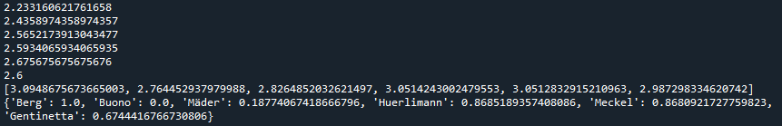
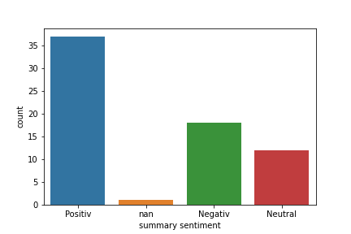

# COINS_SwissTribeleaders
A Repository for Data Storage for the Seminar COINS - Topic Swiss Tribeleaders 

## 11.05.2021 author @Johanna 
First Contribution: Branch Google News with first data collection and code

## 12.06.2021 author @Johanna
New Sentiments are added to the articles in the range of Negative, Neutral, Positive based on 
the word datasets of R. Remus, U. Quasthoff & G. Heyer: SentiWS - a Publicly Available German-language Resource for Sentiment Analysis. 
In: Proceedings of the 7th International Language Ressources and Evaluation (LREC'10), 2010

## Pre-processing
- make all words lowercase
- decode all German characters ä,ü,ö,ß
- remove all non-alphabetical characters 
- use tokenization on the summaries 

The article gets the sentiment depending on what sentiment has the most words assigned.

The sentiment index gets calculated by 
- calculating the mean of the sentiment per author
- substracting/adding the standard deviation devided by 10 from/to the mean depending on whether the highest sentiment is negative or positive
- for now: using a Min/Max Normalization to scale the values on a range from 0 to 1 

Example of the current index assignment to the different authors in the current training set 

- a row of plots is created and saved for the polarity of each author in the training set.

For example the following for Sybille Berg 

- a training set and a test set are defined for the usage in later models 

## BERT
The BERT model gets implemented via Ktrain and trains as well as tests on some pre-prepared datasets.
In a second step it predicts the sentiment of another dataset based on the pre-processed summary and 
outputs the probability of each summary to belong to one of the categories Negative, Neutral and Positive. 

## TO DO
- [ ] Re-think the calculation process of the sentiment for each article
- [ ] Re-think the calculation process of the sentiment_index
- [ ] Search for different normalization methods and see which one is the most applicable
- [ ] Try out a specifically German version BERT like https://deepset.ai/german-bert
- [ ] Try out a specifically German version of GPT-2 like https://github.com/stefan-it/german-gpt2 
